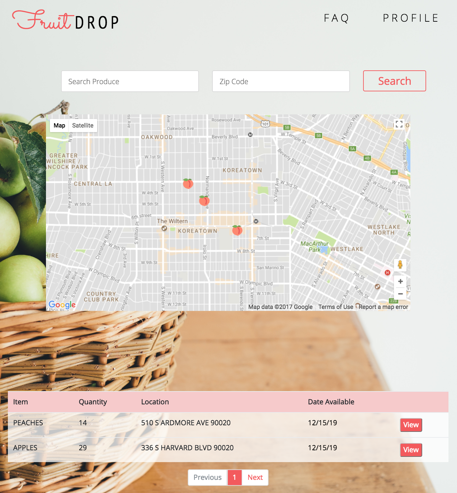

# Fruit Drop

### About

Fruit Drop is a community for home growers who want to share and trade their fruit and produce. This allows everyone in your neighborhoods to benefit from one another and get fresh, organic produce.

### Live Link

https://gracepark.github.io/fruitdrop/public/

### Motivation

Neighbors were struggling with over-producing fruit trees in that there was quite a few waste, fruits were rotting on the ground, and it attracted quite a few critters. Fruit Drop was a way to not only solve this problem, it also benefitted the community.

### Installation

All you need is a browser like Chrome and internet access.

## Authors

Vanessa Montero (@vmov031), Richard Lieu (@lieu510), Fausto Rendon (@frendon001), and Grace Park (@gracepark)

## License

MIT License
